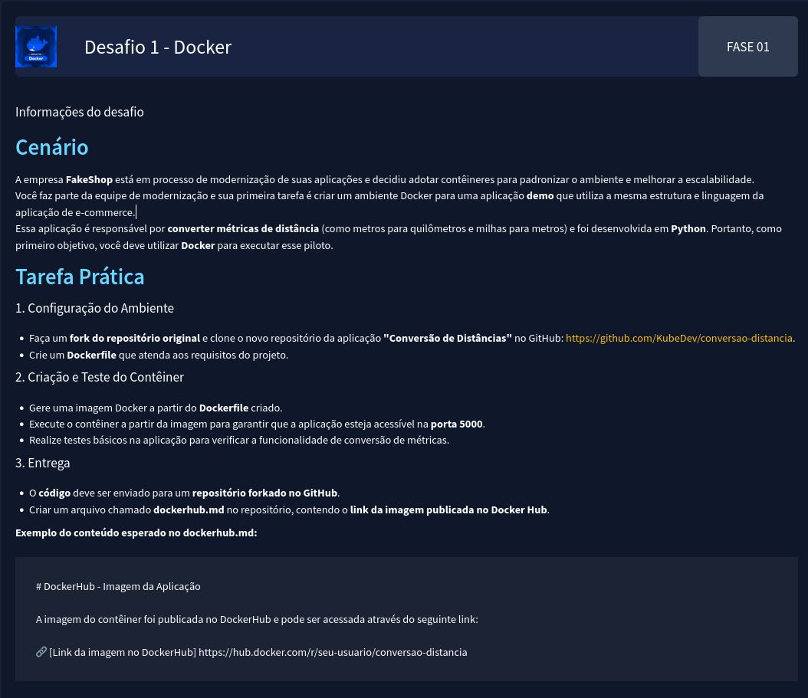

# Conversao de distancia
Projeto para a Semana Devops Pro.
Esse projeto mostra como construir e executar um contêiner Docker.

## Desafio 📌

## Comandos usados:

### Criação da imagem
* `docker build -t conversor-distancia .`

### Lista os processos
* `docker ps`

### Lista as imagens
* `docker images`

### Executa a imagem criada (conversor-distancia) na porta informada (-p 5000:5000) em modo detached (-d)
* `docker run -d -p 5000:5000 conversor-distancia`

### Joga a imagem para o DockerHub
* `docker push rebecabmfonseca/devops-pro-conversor-distancia`
